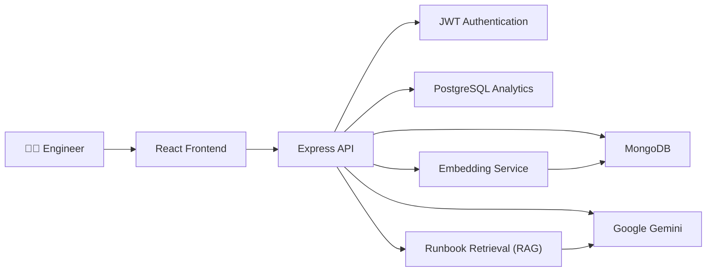

# OpsPilot

AI-powered incident management platform for modern software engineering teams.

OpsPilot helps engineering teams investigate, manage, and resolve production incidents faster by combining Generative AI, semantic search, Retrieval-Augmented Generation (RAG), and incident analytics into a single platform.

---

## Overview

When production incidents occur, engineers often spend valuable time searching documentation, investigating previous incidents, and determining the next troubleshooting steps.

OpsPilot streamlines this workflow by providing AI-powered incident analysis, intelligent runbook retrieval, semantic similarity search, and operational analytics.

For every incident, OpsPilot can:

- Analyze incidents using Google Gemini
- Retrieve relevant operational runbooks (RAG)
- Find semantically similar historical incidents
- Recommend troubleshooting steps
- Track the complete incident lifecycle
- Record AI interactions for observability and analytics

---

## Features

### Incident Management

- Create incidents
- Update incidents
- Delete incidents
- Track incident status
- Assign priorities
- Maintain activity timeline
- Add investigation notes

### AI Features

- AI-powered incident analysis
- Similar incident search using embeddings
- Retrieval-Augmented Generation (RAG)
- AI-generated troubleshooting recommendations
- AI feedback collection
- AI tool execution

### Analytics

- PostgreSQL event analytics
- Incident lifecycle tracking
- AI interaction tracking
- Operational event logging

### Platform

- JWT Authentication
- MongoDB persistence
- Dockerized deployment
- Observability endpoints
- Server-Sent Events (SSE)

---

# Tech Stack

## Frontend

- React
- React Router

## Backend

- Node.js
- Express.js

## Databases

- MongoDB
- PostgreSQL

## AI

- Google Gemini
- Text Embeddings
- Retrieval-Augmented Generation (RAG)
- Prompt Engineering

## DevOps

- Docker
- Docker Compose

---

# Architecture



---

# Project Structure

```
OpsPilot
│
├── backend
│   ├── middleware
│   ├── models
│   ├── routes
│   ├── services
│   ├── server.js
│   └── app.js
│
├── src
│   ├── components
│   ├── pages
│   ├── services
│   └── App.js
│
├── docker-compose.yml
└── README.md
```

---

# Screenshots

### Dashboard


### AI Incident Analysis


### Similar Incident Search


### Runbook Retrieval


---

# Installation

## Clone the repository

```bash
git clone https://github.com/prachishah25/OpsPilot.git
```

```bash
cd OpsPilot
```

---

## Install dependencies

Frontend

```bash
npm install
```

Backend

```bash
cd backend
npm install
```

---

## Environment Variables

Create a `.env` file inside the `backend` folder.

Example:

```text
MONGO_URI=your_mongodb_connection_string

JWT_SECRET=your_secret

GEMINI_API_KEY=your_gemini_api_key

POSTGRES_HOST=postgres

POSTGRES_PORT=5432

POSTGRES_DB=opspilot

POSTGRES_USER=opspilot

POSTGRES_PASSWORD=opspilot_dev_password
```

---

## Run with Docker

```bash
docker compose up --build
```

---

# Future Improvements

- Slack integration
- Email notifications
- Multi-user collaboration
- Incident assignments
- Role-based access control
- Real-time collaboration
- Metrics dashboard
- Kubernetes deployment

---

# Author

**Prachi Shah**

GitHub:

https://github.com/prachishah25

---

# License

This project is intended for educational and portfolio purposes.